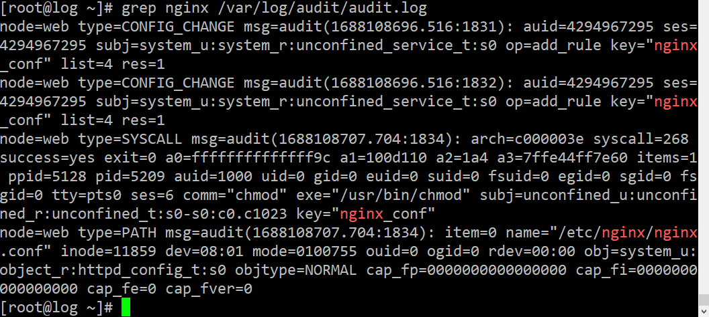

## OTUS Administrator Linux. Professional ДЗ №15: Сбор и анализ логов

**Задание**

1. в вагранте поднимаем 2 машины web и log
2. на web поднимаем nginx
3. на log настраиваем центральный лог сервер на любой системе на выбор
   - journald;
   - rsyslog;
   - elk.
4. настраиваем аудит, следящий за изменением конфигов нжинкса
5. Все критичные логи с web должны собираться и локально (1) и удаленно (2).
6. Все логи с nginx должны уходить на удаленный сервер (локально только критичные).
7. Логи аудита должны также уходить на удаленную систему.

(\*) развернуть еще машину elk:

1. таким образом настроить 2 центральных лог системы elk и какую либо еще;
2. в elk должны уходить только логи нжинкса;
3. во вторую систему все остальное.

**_Решение_**
Решено при помощи vagrant + ansible.

Скриншоты:

Задание 6:

Задание 7:

